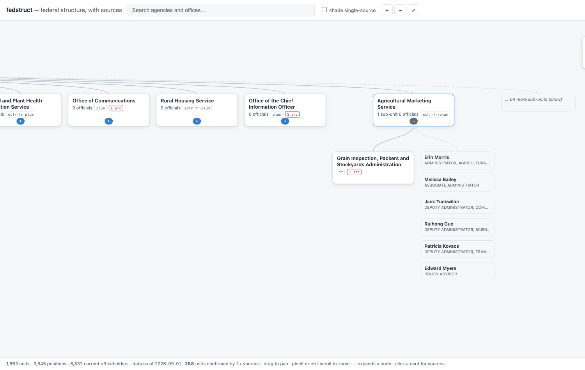

# fedstruct

**An explorable, citable org chart of the US federal government** — what the
units are, how they nest, who currently holds which post — where every fact
links to the government document it came from.



Pan and zoom the chart, expand a department into its sub-agencies and offices,
expand an office into its officeholders, click any card for the full sourced
record. Search flies to a unit with its ancestors and next layer opened.

**Why this doesn't already exist:** commercial vendors (GovSearch, Leadership
Connect) sell exactly this data as a contacts product behind a paywall. The
open civic-data world stops at Congress — [`congress-legislators`](https://github.com/unitedstates/congress-legislators)
is the most successful US civic dataset there is, and it has no
executive-branch counterpart. The raw ingredients are all published free by
the government; what's missing is the join. That join is this project.

## The crosswalk problem

The federal government describes its own structure in several systems that
**share no identifiers**:

| System | What it publishes | Its idea of an ID |
|---|---|---|
| [Federal Register `/agencies`](https://www.federalregister.gov/developers/documentation/api/v1) | 472 agencies with a real parent/child tree | numeric id + slug |
| [eCFR `/admin/v1/agencies`](https://www.ecfr.gov/developers/documentation/api/v1) | 316 agencies mapped to their CFR chapters | its own slug |
| [OPM PLUM](https://www.opm.gov/about-us/open-government/plum-reporting/) (5 U.S.C. § 3330f) | 15,777 positions with named incumbents and dates | **none — uppercase free text** |
| [USAspending](https://api.usaspending.gov) | budget by agency | CGAC codes (111 toptier) |
| [US Government Manual](https://www.govinfo.gov/bulkdata/GOVMAN) | mission/authority prose | its own entity numbers |

Nobody — not GSA, not OMB, not any open-data project — publishes a mapping
between these. The same agency is "Transportation Department" to the Federal
Register, "Department of Transportation" to eCFR, and "DEPARTMENT OF
TRANSPORTATION" to OPM. Reconciling them is most of the real work here, and
getting it wrong is how a project like this fails *quietly*: a false merge
invents relationships that never existed and looks **cleaner** than the truth.

### The rule

> **Join on identifiers, never on names.** Name similarity produces
> *candidates* for adjudication — it never merges anything by itself.

Concretely, units bind across sources by exactly four methods, in strictly
descending trust, and every fact rendered on the site is labeled with the
weakest link in its chain:

1. **`anchor`** — this source's ID minted the unit.
2. **`source_native`** — the source itself published the link (the Federal
   Register's own `parent_id`). Never cross-source.
3. **`crosswalk` / `name_exact`** — two *independently published* government
   identifiers agree 1:1 (matching slugs), or an exact published name is
   **unambiguous**: these two units are its only claimants anywhere, or the
   only claimants under a parent both sources already agree on. "Environmental
   Protection Agency" qualifies. "Office of Inspector General" — with dozens
   of claimants — never can. A merged source's names become aliases of the
   survivor, which is how OPM's "DEPARTMENT OF TRANSPORTATION" reaches the
   Federal Register's "Transportation Department" through eCFR's "Department
   of Transportation" — every hop an exact published name, never a similarity
   score.
4. **`adjudicated`** — a human wrote the decision in
   [`config/adjudications.yaml`](config/adjudications.yaml), with evidence,
   name, and date, in git history where audit trails belong.

Fuzzy similarity — however high the score — only ever creates a review-queue
entry. Merges are **pointers, never rewrites**: deleting one YAML line and
re-running un-merges, so every identity decision is reversible. An explicit
`never_merge` list is consulted before scoring and beats a perfect score
(seeded with the archetype: an agency vs. its statutorily independent Office
of Inspector General, whose names are nearly identical and must never join).

Current state: **419 units bound automatically** on identifier-grade evidence,
**293 genuinely ambiguous candidates waiting for human review** — shipped to
the frontend in `unresolved.json`, because a chart that hides its unfinished
reconciliation looks more finished than it is.

## The honesty layer

- **Every fact carries its citation.** A unit page is a projection of
  statement rows, each with the source URL, retrieval time, extraction method,
  and confidence — rendered as one of three bands (`published` / `linked` /
  `inferred`), never a number implying false precision.
- **Weakest link, not average.** A published budget figure attached to a unit
  through a name match renders as a name match.
- **Absence in a source is not absence in the world.**
  [GAO-26-108164](https://www.gao.gov/products/gao-26-108164) found OPM PLUM
  missing at least 7 federal entities and 130 Senate-confirmed positions, so
  pages say "not listed in PLUM," never "no positions." Known source gaps live
  in [`config/caveats.yaml`](config/caveats.yaml) — the one deliberately
  hand-curated input, because an external audit finding can't be derived from
  the data it audits.
- **Sources may disagree, visibly.** Two sources claiming different parents
  for the same bureau is a representable state and a finding, not a bug to
  resolve away.
- **Structural history begins at this project's first run.** The sources
  publish only current state, so history accrues forward as validity
  intervals (`valid_from`/`valid_to`, closed on change) and can't be mined
  backwards. The one exception: PLUM retains vacated incumbencies, so
  *officeholder* tenure predates run #1. The US Government Manual looks like
  it should provide structural history and doesn't — its XML is flat (all 105
  entities carry `ParentId="0"`) and its officials track a ~2017 base.

## Data model, briefly

One SQLite file. Facts are **statements, not a graph** — rows carrying their
own provenance and three separate timelines (when the fact was true of the
world; the office's statutory term; when our fetcher observed it — the office
term being distinct from a person's tenure is what makes acting officials and
vacancies under the Federal Vacancies Reform Act representable at all). The
org chart is a view. A partial unique index guarantees at most one open
interval per (unit, predicate, source), so classic temporal-store bugs become
`IntegrityError`s at write time instead of silently wrong pages.

Circuit breakers guard the record: a fetch whose row count swings >20%, or a
parse producing more than 40 structural changes at once (identity drift looks
exactly like a mass reorganization, and only one of them is real), quarantines
the run — nothing committed, alarm raised.

## Run it

```sh
python3 -m venv .venv && .venv/bin/pip install -r requirements-dev.txt
cp config/fedstruct.example.yaml config/fedstruct.yaml   # set a contact email
python -m src.main doctor     # preflight — REQUIRED before the first ingest
python -m src.main init
python -m src.main all        # fetch → parse → resolve → build
node tools/serve.mjs          # http://localhost:8031/
```

No API keys: every source is open, which is why the scheduled refresh
(GitHub Actions, monthly for positions, yearly deep pass) keeps working with
zero secrets. Every refresh commits `state/` and `output/` back, so
`git log --oneline -- state/` is a human-readable history of what changed in
the federal government and `git revert` undoes a bad run.

| Verb | Does |
|---|---|
| `doctor` | Preflight — asserts each source's known failure signature, not just HTTP 200 |
| `fetch` / `parse` | Poll due sources through a sha256 gate; turn payloads into statements |
| `resolve --apply` | Propose identity links; bind only identifier-grade evidence |
| `adjudicate` | The human review queue; `--export-yaml <id>` drafts a decision |
| `build` | Statements → deterministic static JSON in `output/` |
| `status` | Staleness, counts, and the headline reconciliation metric |

The headline metric is **units confirmed by 2+ sources** (currently 288). It
*falls* when a bad merge is split, which keeps it honest in the direction that
matters.

## Gotchas worth knowing

- `federalregister.gov` and `ecfr.gov` **block datacenter IPs** with a
  redirect to an unblock page — and *following* it returns HTML that hashes
  stably and parses to zero agencies, i.e. it impersonates a successful,
  unchanged fetch. A redirect off the API host is treated as a hard failure.
  This never fires from a home connection and always fires on CI runners.
- eCFR returns **HTTP 406** unless the request accepts compression.
- Depth ~3 is the ceiling of *published* data. No free source publishes
  structure below the office level (SAM.gov has it, rate-limited to 10
  requests/day). Deeper coverage is a data-acquisition problem, tracked in
  [`BACKLOG.md`](BACKLOG.md) along with the statutory-authority chain
  (eCFR `<AUTH>` → US Code), function search, budget, and the data-availability
  registry.

Tests: `python -m pytest tests/ -q` — 36 tests, none touch the network. The
most important one asserts that identical names without a shared identifier
do **not** merge, so the central rule can't be loosened by accident.

All source data is US Government work (public domain, 17 U.S.C. § 105).
`IMPLEMENTATION-PLAN.md` is the authoritative design doc; code comments cite
it by section.
